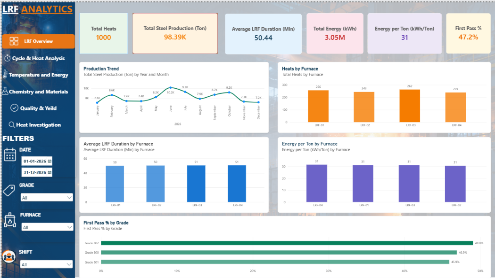
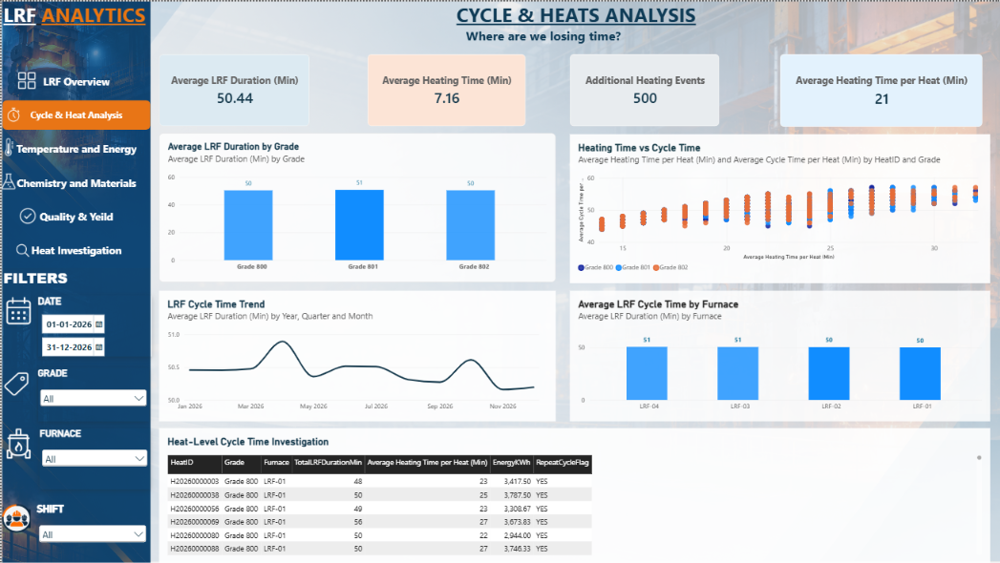
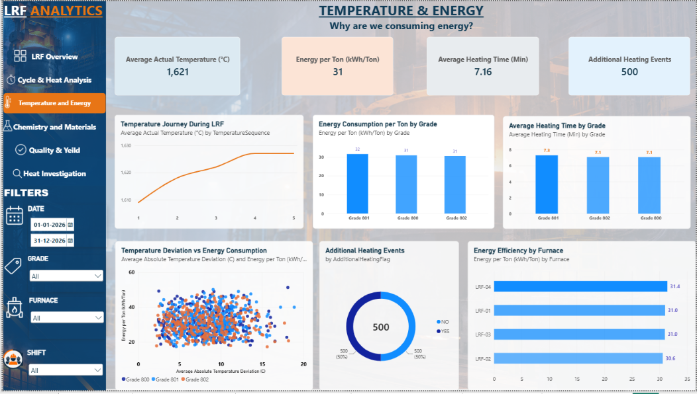
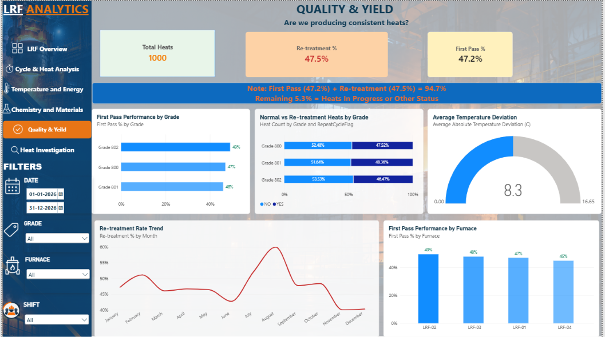
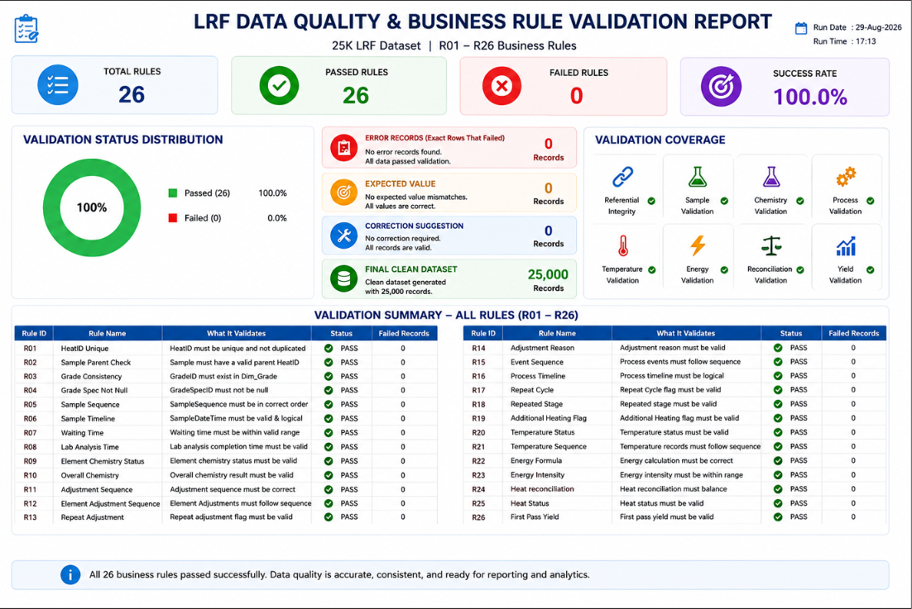

# LRF Optimization — Data Analytics Project

## 📌 Project Overview

**LRF Optimization** is a data analytics project focused on analyzing Ladle Refining Furnace (LRF) process data.

The project follows an end-to-end data analytics workflow:

**Excel Data → Python Data Validation → MySQL → Power BI**

The objective is to validate the quality and consistency of LRF process data, store the structured data in MySQL, and use Power BI for analysis and visualization.

---

## 📊 Dashboard Preview

### LRF Overview



### Cycle & Heat Analysis



### Temperature & Energy



### Quality & Yield




---

## 🎯 Project Objectives

* Validate LRF transaction data using Python.
* Identify invalid or inconsistent records using defined validation rules.
* Load structured Excel data into MySQL.
* Organize the data into fact and dimension tables.
* Analyze LRF production, temperature, energy, chemistry, adjustments, and process-event data.
* Build a Power BI analytics solution for business analysis.

---

## 🔄 Project Workflow

```text
                ┌─────────────────────┐
                │   Excel Source Data │
                └──────────┬──────────┘
                           │
                           ▼
                ┌─────────────────────┐
                │ Python Data         │
                │ Validation          │
                │ R01 – R26           │
                └──────────┬──────────┘
                           │
                           ▼
                ┌─────────────────────┐
                │       MySQL         │
                │ Fact & Dimension    │
                │ Tables              │
                └──────────┬──────────┘
                           │
                           ▼
                ┌─────────────────────┐
                │      Power BI       │
                │ Analysis &          │
                │ Visualization       │
                └─────────────────────┘
```

---

## 🐍 Python Data Validation

Python is used to validate the LRF dataset against a defined set of **26 validation rules (R01–R26)**.

The validation script:

* Loads the Excel workbook.
* Reads transaction and dimension sheets.
* Performs data-quality checks.
* Records invalid records for each rule.
* Produces a final validation summary.

The validation framework includes checks such as:

* Primary-key completeness and uniqueness
* Sequence validation
* Data consistency
* Process-event validation
* Temperature validation
* Chemistry validation
* Heat-status validation
* First-pass validation

The final validation summary reports the number of invalid records identified across the validation rules. 

### 📋 Validation Report

The Python validation framework checks 26 business rules (R01–R26) across the LRF dataset.



---

## 🗄️ MySQL Database

The project uses MySQL to store the structured LRF data.

The SQL database contains **fact tables and dimension tables**.

### Fact Tables

Examples include:

* `fact_heat`
* `fact_sample`
* `fact_adjustment`
* `fact_process_event`
* `fact_energy`
* `fact_temperature`

### Dimension Tables

Examples include:

* `dim_date`
* `dim_element`
* `dim_grade`
* `dim_grade_specification`
* `dim_grade_spec_long`
* `dim_furnace`
* `dim_ladle`
* `dim_material`
* `dim_operator`
* `dim_process_stage`
* `dim_temperature_recipe`

The SQL dump is provided in:

```text
SQL/LRF_Analytics.sql
```

---

## 📊 Power BI

Power BI is used as the visualization and analytics layer of the project.

The Power BI file is available at:

```text
PowerBI/LRF_Analytics.pbix
```

The analytical model uses the structured LRF data to support analysis of areas such as:

* Heat production
* Temperature performance
* Energy consumption
* Alloy adjustments
* Process events
* Chemistry results
* Heat status
* First-pass performance
* Repeat-cycle activity

---

## 📁 Data

The source workbook used by the Python validation and Excel-to-MySQL loading process is:

```text
Data/LRF_Data_Validation.xlsx
```

The dataset contains LRF transaction and dimension/source tables used throughout the project.

The project data is based on **synthetic training data**.

---

## 🛠️ Tools & Technologies

| Tool       | Purpose                                   |
| ---------- | ----------------------------------------- |
| Python     | Data validation and data processing       |
| Pandas     | Reading and processing Excel data         |
| NumPy      | Data processing                           |
| MySQL      | Database storage and SQL analysis         |
| SQLAlchemy | Loading Excel data into MySQL             |
| Power BI   | Data modeling, analysis and visualization |
| Excel      | Source data                               |

---

## 📂 Project Structure

```text
LRF-Optimization-Data-Analytics/
│
├── README.md
├── .gitignore
│
├── PowerBI/
│   └── LRF_Analytics.pbix
│
├── SQL/
│   └── LRF_Analytics.sql
│
├── Python/
│   ├── lrf_data_validation.py
│   └── excel_to_mysql.py
│
├── Data/
│   └── LRF_Data_Validation.xlsx
│
└── Documentation/
```

---

## ▶️ How to Use

### 1. Clone the repository

```bash
git clone https://github.com/YOUR_USERNAME/LRF-Optimization-Data-Analytics.git
```

### 2. Install Python dependencies

```bash
pip install pandas numpy sqlalchemy pymysql openpyxl
```

### 3. Run Python validation

Navigate to the Python folder:

```bash
cd Python
```

Then run:

```bash
python lrf_data_validation.py
```

The script validates the Excel dataset using the defined validation rules and produces a validation summary.

### 4. Load data into MySQL

Configure your local MySQL connection in:

```text
Python/excel_to_mysql.py
```

**Do not commit your real MySQL password to GitHub.**

Then run:

```bash
python excel_to_mysql.py
```

### 5. Open the Power BI project

Open:

```text
PowerBI/LRF_Analytics.pbix
```

Configure the required data connection if necessary.

---

## 🔍 Validation Framework

The Python validation process is organized around rules **R01–R26**.

The validation script collects the result of each rule and generates a final summary containing:

```text
RuleID
Validation
InvalidRecords
```

This makes it possible to identify which validation rules produced invalid records and quantify the data-quality issues.

---

## 📌 Project Files

| File                       | Description                               |
| -------------------------- | ----------------------------------------- |
| `LRF_Analytics.pbix`       | Power BI analytics and visualization file |
| `LRF_Analytics.sql`        | MySQL database dump                       |
| `lrf_data_validation.py`   | LRF data-quality validation script        |
| `excel_to_mysql.py`        | Excel-to-MySQL loading script             |
| `LRF_Data_Validation.xlsx` | Source LRF dataset                        |

---

## 👨‍💻 Author

**Mohammed Zubair Hussain**

Data Analytics Student

---

## 📜 Note

This project is created for **learning, portfolio development, and data analytics practice** using synthetic training data.
